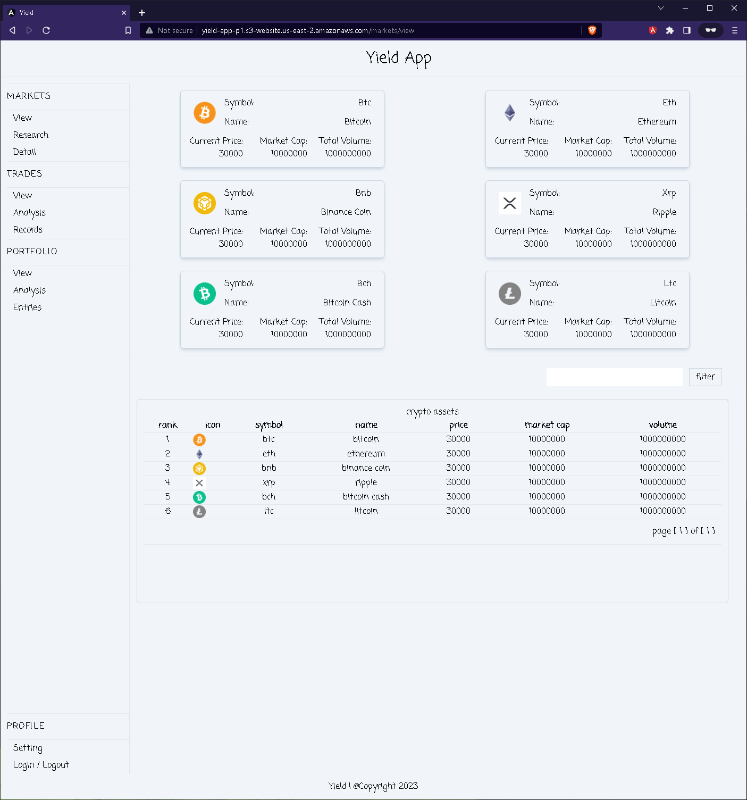
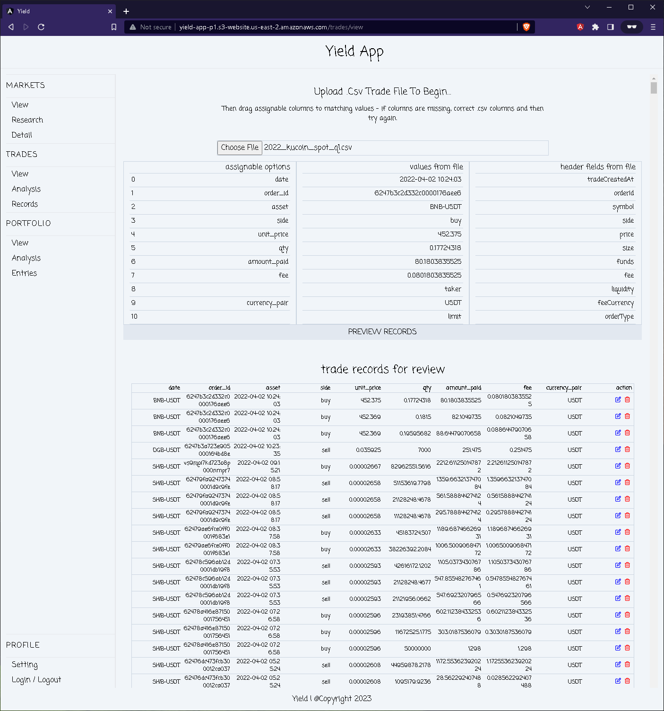
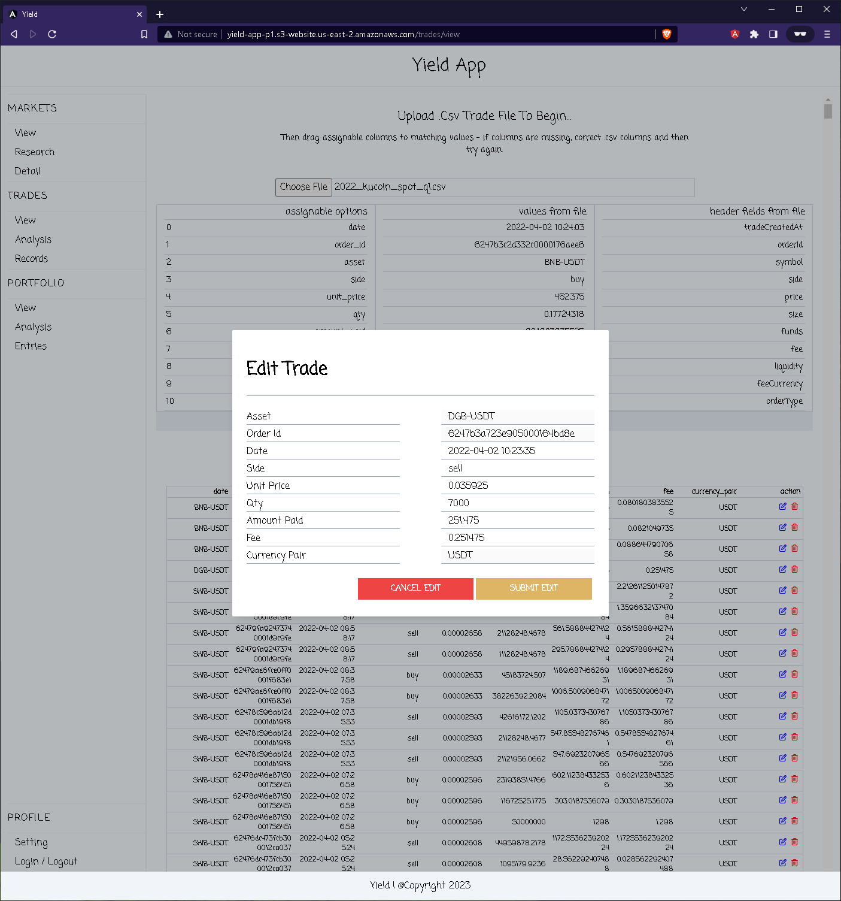

# Yield - A trade analysis app for your trades

## Introduction

Yield is an web application that allows a user to upload a .csv file of their trades and generate reports. The primary feature of this app is generate profit
and loss reports and extract other crypto data for analysis.

The backend is an api with uri endpoints for managing user accounts, their trades and extracting informational data on cryto assets. The api will intitially
retrieve this data by utilizing the CoinGecko api.

As a future feature, the app will integrate the Coinbase API for accepting crypto payment / donations for those feeling the need to donate some of those Gainz!

Example test file for uploading to trades -> view 
- https://www.dropbox.com/scl/fi/lg54jk1gcgv35eol1hw3b/test_profit.csv?rlkey=2w21v0mnohdicv705p61qbs4f&dl=0

  

## FE User Stories

- **As a user**, I do not want to register for an account in order to generate a report. (Initial uploads are processed locally / within FE, so spam uploads
  should not matter)
- **As a user**, I want to be able to register and login, so I can save my trade history and retrieve those records at a later time.
- **As a user**, I want to be able to upload a .csv file containing my trades and retrieve the trading pair asset price, (e.g. btc, eth, bnb) for the date of my
  trade so I can determine my cost-basis and then calculate my profit and loss.
- **As a user**, I want to search and retrieve data for a crypto asset by criteria (i.e. name, price range, marketcap, date) so I am able to analyze my trades
  profit and loss.
- **As a user**, I want to be able to view and search the records of my trade history by asset, date, amount, profit and / or loss.
- **As a user**, I may want to donate for this service after seeing my gains, so I want to be able to send and / or donate using cryptocurrency.

## MVP (Minimum Viable Product)

- **User Authentication:** Allows a user to register and login to their account securely.
- **Parsing Trade Records within a .CSV file:** User to successfully upload and parse their trading records in .csv format.
- **Profit and Loss Analysis for Trades:** User is able to generate a profit and loss report.
- **Chart Analysis for Trades:** Users can analyze and view their trading results in various chart formats, (i.e. pie, bar, line charts -> single and
  multi-asset analysis)
- **Frequency Analysis for Trades:** Users can analyze and view the frequency of their trading results, (i.e. duration trade open, most or least profitable
  duration, asset-trade frequency .vs profit or loss analysis).
- **Historical crypto data search functionality:** Users can search and retrieve a crypto assets historical price, market-cap and volume.
- **Trade history and search functionality:** Users are able to save, modify and retrieve their trading data and history.

<!-- - User can register and login to their account and securely authenticate by jwt-token authentication
- User can parse a .csv file of their trade history and view its details in a table
- User can save, view and modify their trade history details shown within a table
- User can select header columns that will identify each column, (i.e. buy date, sell date, buy qty, sell qty, buy value, sell value, buy fee, sell) fee
- User can update their profile info
- User can retrieve historical crypto price, market cap and volume data within a chart
- User can search a crypto asset by criteria. (i.e. name, price range, marketcap, volume, date)
- User can generate and view their profit and loss for an asset within a chart view
- User can generate their profit & loss report in .csv format
- Api endpoint accepts and properly handles errors for a user registration request and creates a new account for a new user.
- Api endpoint accepts and properly handles errors for a user login request and authenticates the user using jwt authentication.
- Api endpoint accepts and properly handles errors for a registered users request to store / save their trade history data.
- Api endpoint accepts and properly handles errors for modifying trade / order history.
- Api endpoint accepts users requests to retrieve data for a crypto asset by criteria. (i.e. name, price range, marketcap, date)
- Api endpoint accepts an authenticated users request to update their profile info.
- Server is able to fetch and properly handles errors when retrieving crypto asset data from an external api. (i.e. Coingecko)
- Server is able to store / persist crypto asset data received from an external api. (i.e. Coingecko) -->

## Stretch Goals

- Implementing the Coinbase API for accepting / making donations / payment by crypto
- Add portfolio manager and enhance the UI with charts, graphs and analytical data of an asset
- Implementing trading view api for showing charts of supported assets
- Add 3rd party signup options, e.g. Google
- Generating P&L report and sending the report back the user in .csv and / or .json format.
- Add asynchronous processing or threads for fetching API data.
- Add a recommendation engine utilizing crypto / asset data from Coingecko (e.g. add additional endpoints to extract more data from Coingecko, use trade
  history)
- Generate report and send to registered email.
- Implement threads when generating reports.

## Tech Stack

### **Front-end stack**

- **Angular**: A javascript framework for creating the UI
- **Tailwind CSS**: CSS library for styling the UI
- **ng2-charts**: A library for charts
- **ngx-papaparse**: A .csv creator and parser
- **Npm**: A package manager for managing dependencies
- **Jasmine, Karma**: Testing libraries

### **Back-end stack**

- **Java**: The main programming language used for building the application.
- **PostgreSQL**: Used as the database to store user reports and cryptocurrency related data.
- **JDBC (Java Database Connectivity)**: An API for connecting and executing queries on the database.
- **Maven or Gradle**: Used for managing project dependencies.
- **BCrypt**: A Java library for hashing and checking passwords for security.
- **Log4j**: A logging utility for debugging purposes.
- **JUnit**: A testing framework for Java applications, used to ensure our code works as expected.
- **Mockito, and PowerMock**: Used for unit and integration testing.
- **Git and GitHub**: Used for version control.

## Requirements

- **Clean Codebase**: All code should be clean and well-documented. The repository should not include any unnecessary files or folders such as the `target/`,
  `.DS_Store`, etc. All files and directories should be appropriately named and organized.

- **Secure**: The application should not display any sensitive information in error messages.

- **Error Handling**: The application should handle potential errors gracefully and provide clear and helpful error messages to the users.

- **FE Testing**: The application should have a high test coverage. Unit tests and integration tests should be implemented using Jasmine and Karma.

- **BE Testing**: The application should have a high test coverage. Unit tests and integration tests should be implemented using JUnit, Mockito, and PowerMock.

- **Version Control**: The application should be developed using a version control system, preferably Git, with regular commits denoting progress.

- **Documentation**: The repository should include a README file with clear instructions on how to run the application. Code should be well-commented to allow
  for easy understanding and maintenance.

- **Scalable**: The design of the application should be scalable, allowing for easy addition of new features or modifications in the future.

## Running and building the angular app

This project was generated with [Angular CLI](https://github.com/angular/angular-cli) version 14.2.9.

## Development server

Run `ng serve` for a dev server. Navigate to `http://localhost:4200/`. The application will automatically reload if you change any of the source files.

## Code scaffolding

Run `ng generate component component-name` to generate a new component. You can also use `ng generate directive|pipe|service|class|guard|interface|enum|module`.

## Build

Run `ng build` to build the project. The build artifacts will be stored in the `dist/` directory.

## Running unit tests

Run `ng test` to execute the unit tests via [Karma](https://karma-runner.github.io).

## Running end-to-end tests

Run `ng e2e` to execute the end-to-end tests via a platform of your choice. To use this command, you need to first add a package that implements end-to-end
testing capabilities.

## Further help

To get more help on the Angular CLI use `ng help` or go check out the [Angular CLI Overview and Command Reference](https://angular.io/cli) page.
